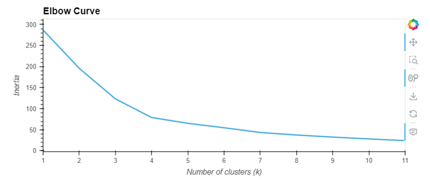
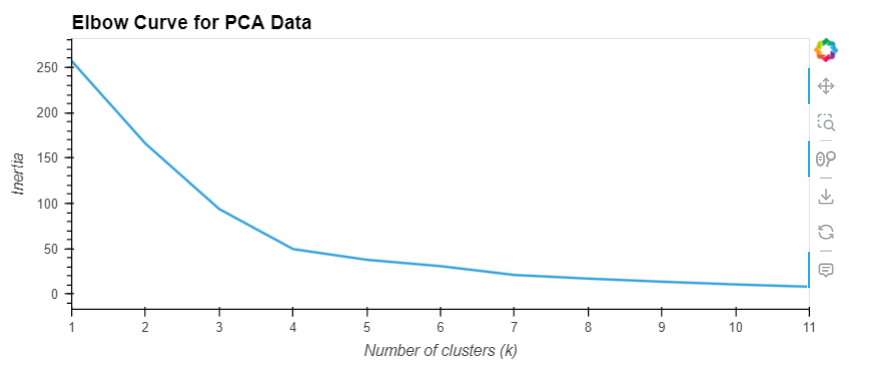
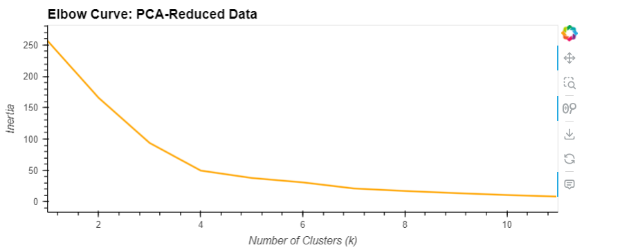

# CryptoClustering
Module 19 Challenge

In this challenge, the following questions and answers also correspond to the requirements of the assignment.  The starter code provided insight into each step needing performed in order to answer all of the questions for the assignment.  Thus, below are answers to questions within the Jupyter Notebook.

Question: What is the best value for k?
Answer:  I would say K = 4 is the best value.  It is the location where there is a distinct change in direction from vertical to horizontal.  There is one more change at K=7, however at that point, the difference in slope appear to be fairly insignificant and the transition from vertical to horizontal has already occurred.

Answer the following question:
Question: What is the total explained variance of the three principal components?

Answer:  The total of the explained variance of the three principal components is the sum of the three = 0.371 + 0.347 + 0.176 = 0.895

Answer the following questions:
•	Question: What is the best value for k when using the PCA data?
	Answer: I would say K = 4 is the best value.  It is the location where there is a distinct change in direction from vertical to horizontal.  There is one more change at K=7, however at that point, the difference in slope appear to be fairly insignificant and the transition from vertical to horizontal has already occurred.
•	Question: Does it differ from the best k value found using the original data?
	Answer: No

I utilized notes from class and also consulted ChatGPT to complete all the coding requirements within the starter code provided.
